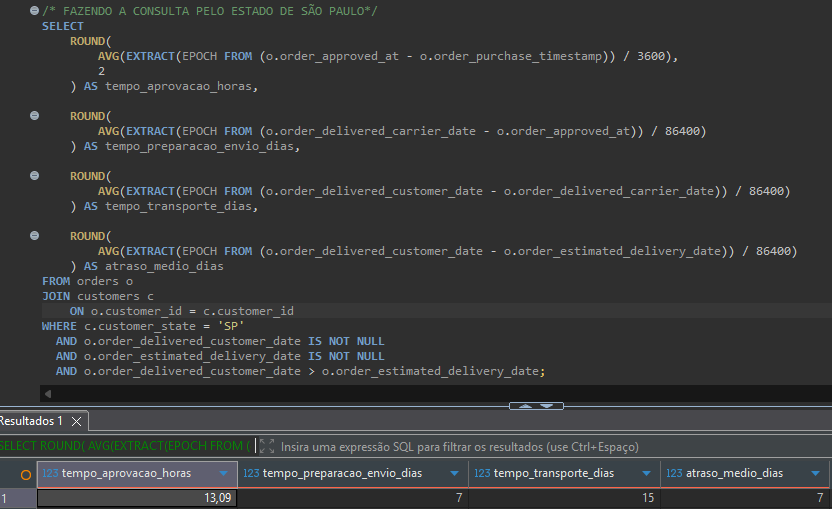

# 📊 Projeto de Análise de Dados — Brazilian E-Commerce (Olist)

## 📌 Visão Geral
Este projeto realiza uma **análise de dados end-to-end** utilizando o *Brazilian E-Commerce Public Dataset by Olist*, com o objetivo de extrair **insights de negócio** relacionados a clientes, logística, pagamentos, produtos e faturamento.

O dataset reúne informações de aproximadamente **100 mil pedidos realizados entre 2016 e 2018**, permitindo analisar todo o ciclo do pedido — desde a compra até a entrega e avaliação do cliente.

---

## 🎯 Objetivos do Projeto
- Analisar o comportamento dos clientes
- Avaliar performance logística e atrasos de entrega
- Identificar categorias e produtos mais vendidos e mais lucrativos
- Explorar padrões de faturamento ao longo do tempo
- Construir dashboards interativos para apoio à tomada de decisão

---

## 📂 Conjunto de Dados
- **Fonte:** Kaggle — Brazilian E-Commerce Public Dataset by Olist  
  🔗 https://www.kaggle.com/datasets/olistbr/brazilian-ecommerce
- **Formato:** CSV
- **Quantidade de tabelas:** 8
- **Período:** 2016 – 2018

### 🧩 Modelo Lógico

---

## 🛠️ Ferramentas Utilizadas
- **Python**
  - Leitura, limpeza e transformação dos dados
  - Processo de ETL para PostgreSQL
- **PostgreSQL**
  - Criação de tabelas, constraints e índices
  - Consultas analíticas em SQL
- **DBeaver**
  - Execução e organização das queries SQL
- **Power BI**
  - Modelagem de dados
  - Criação de medidas em DAX
  - Construção de dashboards interativos

📄 *As constraints e índices estão documentados no arquivo*  
`constraints_and_indexes.sql`

---

## 📊 Dashboard Interativo
O dashboard apresenta indicadores-chave de performance (KPIs) e permite análise dinâmica por período, estado e categoria.

---

## 🔍 Principais Perguntas & Insights

### 👥 Clientes
- **Clientes únicos:** +96 mil
- **Clientes recorrentes:** 2.997
- **Ticket médio por cliente:** R$ 166,59
- **Estados com mais clientes:**  
  1. São Paulo  
  2. Rio de Janeiro  
  3. Minas Gerais  

---

### 🚚 Logística & Entregas
- **Tempo médio de entrega:** 12 dias
- **Pedidos entregues fora do prazo:** 7.827 pedidos
- **Estados com mais atrasos:**
  1. São Paulo
  2. Rio de Janeiro
  3. Minas Gerais

#### 🔎 Análise de Causas dos Atrasos
Com base nos dados temporais dos pedidos, os atrasos foram analisados considerando:

- Aprovação do pagamento
- Preparação e despacho pelo vendedor
- Transporte até o cliente
- Estimativa de entrega (SLA)

📍 *Comparação de tempos médios por estado:*

**São Paulo**  

**Bahia**  

**Insight-chave:**
> Embora São Paulo concentre o maior volume de pedidos atrasados, o principal gargalo está no tempo de preparação do envio e na entrega final, e não na aprovação do pagamento. O alto volume logístico impacta diretamente o SLA.

---

### 💳 Pagamentos
- **Forma mais utilizada:** Cartão de crédito
- **Média de parcelamento:** 4 parcelas

---

### 📦 Produtos & Categorias
- **Categoria com maior faturamento:** beleza_saude  
  ➜ R$ 1,25 milhão
- **Categoria mais vendida (volume):** casa_mesa_banho  
  ➜ +11 mil itens
- **Categorias com alto volume e baixo faturamento:**  
  Destaque para *telefonia*, com alto volume de vendas e ticket médio reduzido
- **Produtos mais vendidos vs. mais lucrativos:**  
  Análise comparativa entre volume e faturamento por produto

---

### 💰 Vendas & Receita
- **Faturamento total:** +R$ 16 milhões
- **Pico de faturamento:** Novembro de 2017  
  ➜ R$ 1,19 milhão
- **Evolução temporal:** crescimento significativo ao longo de 2017

---

## 🚀 Conclusão
Este projeto demonstra uma abordagem completa de **Data Analytics**, integrando Python, SQL e Power BI para transformar dados brutos em **insights acionáveis**, com foco em problemas reais de negócio como logística, receita e comportamento do cliente.
