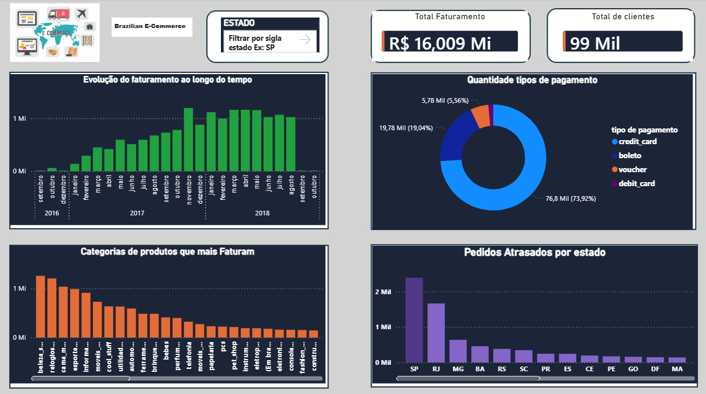

# Projeto de Análise de Dados - Brazilian E-commerce by Olist
Este é um conjunto de dados público brasileiro de comércio eletrônico com pedidos realizados na loja Olist. O conjunto de dados contém informações de 100 mil pedidos feitos entre 2016 e 2018 em diversos marketplaces no Brasil. 
Seus recursos permitem visualizar um pedido sob múltiplas perspectivas: desde o status do pedido, preço, pagamento e desempenho do frete até a localização do cliente, atributos do produto e, finalmente, avaliações escritas pelos clientes. 
Também disponibilizamos um conjunto de dados de geolocalização que relaciona CEPs brasileiros a coordenadas de latitude e longitude.

# Conjunto de dados
Os dados utilizados estão distribuidos em oito tabelas. O dataset está disponível no Kaggle [Aqui](https://www.kaggle.com/datasets/olistbr/brazilian-ecommerce).
O modelo lógico do banco de dados é apresentado no seguinte formato:

# Apresentação Dashboard Interativo
No dashboard encontram-se as principais métricas e indicadores que permitem uma compreensão da performance de pedidos realizados na loja Olist:

# Ferramentas
Para fazer essa análise, foram utilizadas algumas ferramentas, tais quais:
* **Python**: Para realizar a leitura, transformação de dados e carregar os dados para o PostgreSQL, processo de (ETL).
* **SQL**: As consultas foram estruturadas através do DBeaver, utilizando o PostgreSQL
  Obs: Criação de constraints e indexes para as tabelas está demonstrado no arquivo `constraints_and_indexes.sql`
* **Power BI**: O dashboard do projeto foi construído com o uso do software, com a necessidade da criação de algumas funções em Dax
  para a construção das visualizações e também para que os gráficos se tornassem interativos.

# Perguntas e Insights
Eu separei por pastas cada tópico e suas devidas perguntas e com isso vem os insights.

## Clientes:
### 01.  Quantos clientes únicos ?
  
  O total de mais de 96 mil clientes

### 02. Quantos clientes recorrentes ?

  O total de 2.997 clientes recorrentes

### 03. Qual o ticket médio por cliente ?

  O valor do ticket médio por cliente é de R$ 166,59 reais

### 04. Total de clientes por estado

  No representação, o ranking mostrou que São paulo é o estado com mais números de clientes com 40.302 mil, seguido dele tem o estado do Rio de janeiro com 12.384 e
  Minas gerais com 11.259 clientes.

## Logística e Entregas:
### 01. Qual é o tempo médio de entrega ?

  O tempo médio de entrega é de 12 dias
  
### 02. Estados com mais atrasos de entrega ?

  Na representação, o ranking mostrou que São paulo é o estado com mais casos registrados de atrasos de entrega com 2.387 mil registrados, seguido por Rio de janeiro com 1.664 mil casos registrados
  FAZENDO AS ANÁLISES DOS TRÊS ESTADOS COM MAIS PEDIDOS SP,RJ E MG FICA A PERGUNTA. POR QUÊ ESSES ESTADOS ATRASAM MAIS ?
  
  POSSÍVEIS CAUSAS E CONSIDERANDO A LIMITAÇÃO DOS DADOS MAS MESMO ASSIM TENDO A LINHA DO TEMPO DE CADA PEDIDO NOS PODEMOS SUPOR VÁRIAS CAUSAS

  Atraso na aprovação do pagamento
  Possíveis causas:
    problemas no pagamento,
    boletos demorando,
    análise antifraude

  Atraso no envio pelo vendedor
  Possíveis causas:
    estoque,
    atraso na coleta

  Atraso no transporte
  Possíveis causas:
    logística urbana,
    alto volume de entregas,
    congestionamento,
    múltiplas tentativas

  Prazo mal estimado
  Possível causa:
    SLA irreal,
    subestimação do prazo para regiões específicas

  Agora quando fazemos as consultas por estado pra termos em detalhes a média de tempo de cada processo. Começando por São paulo
  
  

  Agora pelo estado da Bahia

  

  ## Insight
  `“ Embora São Paulo concentre o maior número de pedidos atrasados, o principal gargalo não é a aprovação do pagamento, 
     mas sim o despacho pelo vendedor e a entrega final, que juntos representam a maior parte do atraso.
     Quando comparados com outros estados com menos casos de pedidos atrasados, a média de tempo_preparacao_envio_dias de
     São Paulo é a mais alta, Influenciando total na entrega de pedidos. ”`
     
### 03. Total de pedidos entregues fora do prazo

  O total de pedidos entregues fora do prazo é de 7.827 mil pedidos.

## Pagamento
### 01. Formas de pagamento mais usadas 

  No topo a forma mais usada de pagamento foi o cartão de crédito com 76.795 mil registros, seguido dele o boleto com 19.784 mil registros.

### 02. Média de parcelamento

  A média de parcelamento é de 4 parcelas

## Produtos e Categorias
### 01. Quais categorias mais faturam ?

  A categoria que mais fatura é a categoria de beleza_saude com R$ 1.258.681,34 milhões de reais.
  
### 02. Quais categorias mais vendem ?

  A categoria que mais vende é a categoria de casa_mesa_banho com 11.115 mil itens vendidos.
  
### 03. Categorias com alto volume de quantidades mas baixo faturamento

  Nessa consulta eu filtrei por categorias que venderam mais de 1000 itens e com faturamento menor que R$ 500.000,00 reais.
  A categoria telefonia vendeu 4.545 itens e com faturamento de 323.667,53 e entre outras categorias que tiveram o faturamento abaixo disso.
  
### 04. Produtos mais vendidos vs produtos com maior faturamento

  Nessa consulta mostra a diferença entre a quantidade de vendas dos produtos e seu faturamento.

## Vendas e Receitas
### 01. Qual é o faturamento total ?

  O faturamento total foi de mais de R$ 16 milhões de reais.
  
### 02. Como o faturamento evoluiu ao longo do tempo (mes/ano)

  Nessa consulta mostra a evolução do faturamento ao longo do mes/ano com uma forte alta no ano de 2017 no mês de novembro onde alcançoou o faturamento de R$ 1.194.882,00 reais.
  
### 03. Qual o ticket médio por período ?

  Nessa consulta mostra o ticket médio por mes/ano com uma média mais alta em 2018 no mês de setembro onde alcançou R$ 277,47 reais.
